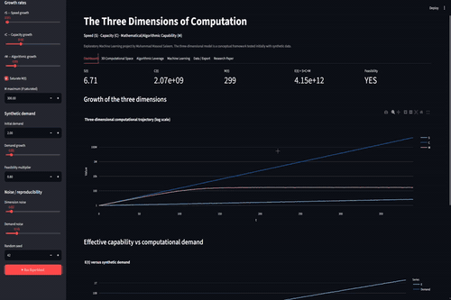

# The Three Dimensions of Computation

**An Exploratory Machine-Learning Framework for Speed, Capacity, and Mathematical/Algorithmic Capability**

**Author:** Muhammad Masood Saleem  
**Program:** Post Graduate Diploma — Data Science & AI  
**Institution:** NED University  
**Email:** masoodsaleem@hotmail.com

## Project Overview

This repository contains my exploratory Machine Learning project, **The Three Dimensions of Computation**.

The project began with a philosophical question: computational progress is usually discussed in terms of faster hardware and larger memory or storage, but better mathematics and algorithms can also make a problem require fewer physical resources. I wanted to give that idea enough structure that it could be experimented with computationally rather than discussed only at a conceptual level.

I therefore use an initial three-dimensional model:

```text
X(t) = [S(t), C(t), M(t)]
```

where:

- **S(t) — Speed:** available computational speed or throughput.
- **C(t) — Capacity:** the ability to store, represent, access, and move information.
- **M(t) — Mathematical/Algorithmic Capability:** improvements in methods, algorithms, representations, transformations, compression, approximation, sparsity, optimization, parallelization, and related techniques that can reduce computational requirements.

These are **exploratory variables**, not established fundamental dimensions of computation.

## 🎬 Streamlit Demo

<p align="center">
  
</p>

<p align="center">
  <em>Interactive demonstration of the Three Dimensions of Computation ML application.</em>
</p>

The application allows users to interactively explore the proposed **Speed (S)**, **Capacity (C)**, and **Mathematical/Algorithmic Capability (M)** dimensions, modify synthetic assumptions, visualize computational trajectories, and compare Machine Learning models.

## Why Synthetic Data?

The difficult part of the idea is **M(t)**. Speed and capacity can eventually be connected to measurable hardware quantities, but there is no simple universal unit for "mathematical/algorithmic capability."

For that reason, this first version uses **synthetic data**. The purpose is to create a controlled theoretical laboratory in which assumptions are explicit and can be changed.

The synthetic experiment does **not** prove that the assumed growth rates or feasibility rules describe the real world. It shows what follows *if* those assumptions are used.

## Machine Learning Objective

Machine learning is the practical experimental component of the project.

The main classification problem is:

```text
P(Feasible | S, C, M)
```

The application generates synthetic observations of the three dimensions, constructs an experimental feasibility target, and compares supervised classification models.

Current models include:

- Logistic Regression
- Decision Tree
- Random Forest
- K-Nearest Neighbors
- Support Vector Machine
- Gaussian Naive Bayes
- Gradient Boosting
- Multi-Layer Perceptron Neural Network

The models can be compared using:

- Accuracy
- Precision
- Recall
- F1 Score
- ROC-AUC
- Confusion Matrix
- ROC Curves
- Precision–Recall Curves
- Feature Importance where supported
- Predicted Probability Distribution

The application also provides 2D and 3D visualizations of the synthetic computational space.

## Exploratory Computational Model

The current sandbox uses:

```text
X(t) = [S(t), C(t), M(t)]
```

and an abstract effective-capability quantity:

```text
E(t) = S(t) × C(t) × M(t)
```

`E(t)` is **not claimed to be a physical law**. It is an experimental definition that makes interactions among the dimensions easy to study.

The application also uses the normalized exploratory dominance ratio:

```text
D_M(t) = M_n(t) / (S_n(t) + C_n(t))
```

Again, this is a synthetic analytical device rather than a universal definition of algorithmic dominance.

## Synthetic Worlds

The Streamlit sandbox includes four configurable scenarios:

1. **Hardware Dominant** — Speed and Capacity grow faster than M.
2. **Balanced Development** — physical and algorithmic progress grow at roughly comparable rates.
3. **Algorithmic Dominance** — M grows rapidly enough to compensate for increasing physical limitations within the synthetic model.
4. **Mathematical Saturation** — M approaches a limiting value instead of growing indefinitely.

All growth rates, initial values, noise levels, computational demand, feasibility assumptions, and the random seed can be changed interactively.

## Streamlit Application

The application contains the following tabs:

- **Dashboard** — the three dimensions, effective capability, feasibility, and growth curves.
- **3D Computational Space** — trajectory through S–C–M space.
- **Algorithmic Leverage** — normalized dominance and growth-rate comparisons.
- **Machine Learning** — model comparison, classification metrics, ROC/PR curves, confusion matrices, feature importance, probability distributions, and computational-space plots.
- **Data / Export** — inspect and export generated synthetic data.
- **Research Paper** — displays the separate HTML research paper directly inside Streamlit.

## Research Paper as a Separate File

The paper is deliberately kept separate from `app.py`:

```text
The_Three_Dimensions_of_Computation.htm
```

`app.py` loads this file at runtime. Therefore, when the HTML paper is edited and the updated file is committed/deployed, the **Research Paper** tab displays the new version without requiring the research text to be copied into the Python source.

Keep the HTML file in the **same repository folder as `app.py`**.

## Repository Structure

```text
.
├── app.py
├── The_Three_Dimensions_of_Computation.htm
├── README.md
└── requirements.txt
```

## Running Locally

Install the requirements:

```bash
python -m pip install -r requirements.txt
```

Run Streamlit:

```bash
streamlit run app.py
```

Then open the local URL shown by Streamlit, normally:

```text
http://localhost:8501
```

## Showing the HTML Research Paper on GitHub

Yes. GitHub can store the `.htm` file in the repository and visitors can open it to inspect the source/content.

However, GitHub's normal repository file viewer does **not behave like a full website host for arbitrary HTML**. For a properly rendered browser version, the better option is **GitHub Pages**.

A simple approach is to keep:

```text
The_Three_Dimensions_of_Computation.htm
```

in the repository and either:

- link to the file from this README for repository access, or
- publish the repository through **GitHub Pages** and expose an HTML page there.

For the best GitHub experience, the README should remain the main project landing page, while the HTML paper can serve as the full research document and the Streamlit app can provide the interactive experiment.

## Research Status and Limitations

This repository represents an **exploratory academic project**, not a validated scientific theory.

Important limitations include:

- S, C, and M do not yet share a common empirical unit.
- M(t) is especially difficult to operationalize with real data.
- The dimensions may be coupled rather than independent.
- The synthetic feasibility label is generated from experimental assumptions.
- Strong ML performance on synthetic labels does not validate the philosophical theory.
- Synthetic scenarios cannot establish historical or physical truth.
- Historical validation will require carefully constructed real-world proxy variables.

## Future Work

The next major research step is to move gradually from synthetic experimentation toward empirical validation. Possible directions include:

- defining measurable proxies for S, C, and especially M;
- studying fixed-capability tasks over time to estimate algorithmic efficiency gains;
- comparing algorithmic gains with hardware gains;
- testing alternative functional forms for effective computational capability;
- modeling S, C, and M as coupled variables;
- performing systematic sensitivity analysis;
- estimating a computational feasibility frontier from real observations;
- connecting empirical findings more rigorously with complexity and computability theory.

## Academic Position

The project does not assume that mathematical capability is unlimited and does not claim that algorithms will necessarily dominate hardware.

The current question is narrower:

> Under explicitly defined assumptions, how does computational feasibility change as Speed, Capacity, and Mathematical/Algorithmic Capability change?

The value of the project at this stage is that the question now has a reproducible computational structure that can be tested, criticized, refined, and eventually compared with real data.

## Starting Literature

- Hernandez, D., & Brown, T. B. (2020). *Measuring the Algorithmic Efficiency of Neural Networks.* arXiv:2005.04305.
- Wang, Y., Ding, C., Li, Z., et al. (2018). *Towards Ultra-High Performance and Energy Efficiency of Deep Learning Systems: An Algorithm-Hardware Co-Optimization Framework.* Proceedings of the AAAI Conference on Artificial Intelligence.
- Sun, P., Su, Z., Achterberg, J., et al. (2026). *Algorithm–hardware co-design of neuromorphic networks with dual memory pathways.* Nature Machine Intelligence, 8, 901–912.

---

**Muhammad Masood Saleem**  
Post Graduate Diploma — Data Science & AI  
NED University  
masoodsaleem@hotmail.com
